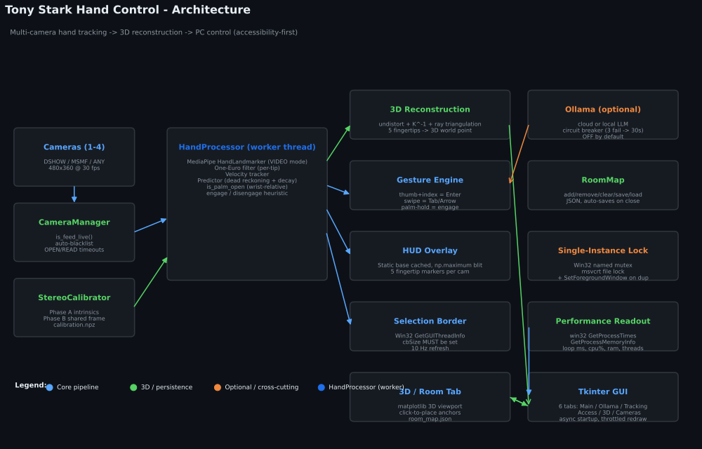

# Tony Stark Hand Control

**Performance-oriented multi-camera hand tracking for PC control — in the spirit of the Iron Man HUD.**

A local-first, accessibility-focused hand-tracking system. Point one (or up to four) webcams at yourself, hold up an open palm, and your hand becomes a controller — swipes drive keyboard navigation and thumb-to-finger contacts trigger keyboard actions. Those fingertip actions currently repeat while held; see [Issue #13](https://github.com/Capslockb/tony-stark-hand-control/issues/13). The Room tab also includes an experimental stereo 3D view, but its live coordinates are not yet validated for measurement or automation. Camera-frame processing stays on-device in the core path; however, MediaPipe's current privacy notice states that its Tasks APIs may send performance and utilization metrics to Google. Optional Ollama-compatible snapshot inference is off by default and can target a local or remote endpoint. No mouse required.

[](LICENSE)
[](https://www.python.org)
[](#quick-start)
[](#privacy)
[](https://github.com/Capslockb/tony-stark-hand-control/actions/workflows/ci.yml)

> 🌐 **Live site:** [**capslockb.github.io/tony-stark-hand-control**](https://capslockb.github.io/tony-stark-hand-control/) — guided install flow, no clone required.
> 📱 **On your phone?** Open the mobile install page: [**capslockb.github.io/tony-stark-hand-control/mobile**](https://capslockb.github.io/tony-stark-hand-control/mobile/)
>
> ⚠️ **Current `main` regression:** after Start, the application currently schedules the first processing iteration but not the next one. Live camera and gesture behavior on `main` is blocked by [Issue #16](https://github.com/Capslockb/tony-stark-hand-control/issues/16). Do not treat the runtime or performance claims below as current validation until a reviewed fix lands.

<p align="center">
  
</p>

---

## Why this exists

Most webcam hand-tracking demos do **mouse emulation** — they hand you a virtual mouse and call it a day. That's broken for real use: clicking the wrong thing is one pixel of slop away, every menu fights you, and the cursor is always exactly where you don't want it.

Tony Stark Hand Control takes a different approach: **accessibility navigation**. Swipes send `Tab` / `Shift+Tab` / `↑` / `↓`, thumb-touches fire `Enter` and the context-menu key, and on the primary Windows path a **persistent green border** tracks the focused UI element so you always know what will activate. It's the same paradigm every operating system already uses for keyboard navigation — we just drive it with a hand.

For the people who want a mouse anyway, screen-cursor mode is one checkbox away. The Room tab can also render experimental multi-camera fingertip triangulation alongside manually placed walls, zones, and hotspots. Live stereo coordinates are currently unvalidated because the calibration and reconstruction paths use incompatible extrinsic conventions; see [Issue #6](https://github.com/Capslockb/tony-stark-hand-control/issues/6).

---

## Features

| | |
|---|---|
| **Multi-camera capture** | Auto-detects up to 4 cameras (DSHOW → MSMF → ANY). A single shared asynchronous MediaPipe worker currently serializes inference, and completed results are not yet owned per camera; see [Issue #7](https://github.com/Capslockb/tony-stark-hand-control/issues/7). |
| **3D room mapping** | Manual anchors and JSON persistence are available; live stereo hand coordinates remain experimental pending [Issue #6](https://github.com/Capslockb/tony-stark-hand-control/issues/6). |
| **Tracking pipeline** | Shared asynchronous MediaPipe worker, One-Euro filtering, and a velocity-based predictor. Recurring delivery is currently blocked by [Issue #16](https://github.com/Capslockb/tony-stark-hand-control/issues/16), and per-camera result ownership by [Issue #7](https://github.com/Capslockb/tony-stark-hand-control/issues/7). |
| **Accessibility-first** | Swipes send Tab / Shift+Tab / Arrow keys, palm-hold engages, thumb+index triggers `Enter`. Fingertip actions are currently level-triggered; see [Issue #13](https://github.com/Capslockb/tony-stark-hand-control/issues/13). **No mouse required.** |
| **Persistent selection overlay** | On Windows, a green border polls the focused UI element at 10 Hz. Linux and macOS focus-discovery and overlay parity remain roadmap work. |
| **Engage / disengage** | Open-palm detections are averaged over the last 10 loop samples. After the average exceeds 0.6, it must remain active for the configured hold duration (0.6 s by default); lowering the hand or closing the palm disengages. |
| **Live performance readout** | Per-loop ms and target FPS on all platforms; app CPU%, RAM, and thread count are Windows-specific telemetry |
| **Single-instance lock** | One app at a time. Second launch focuses the existing window instead of stuttering |
| **Local-first core** | Camera input and hand-processing data stay on-device. MediaPipe may send API performance and utilization metrics under its current privacy notice; the repository does not add its own application telemetry. |
| **Optional snapshot classifier** | Send snapshots to an Ollama API-compatible endpoint for classification within the fixed built-in `GESTURE_KEYS` vocabulary. Unknown labels become `none`; prompt edits alone do not add actions. Off by default; OpenAI-compatible llama.cpp servers require an adapter. |
| **Platform status** | Windows is the primary tested path; Linux and macOS parity remain roadmap work |

---

## Quick start

**Option A — install from source**:
```cmd
git clone https://github.com/Capslockb/tony-stark-hand-control.git
cd tony-stark-hand-control
python install_wizard.py
start_windows.bat
```

**Option B — download the prebuilt .exe** (easiest, no Python needed):
1. Go to https://github.com/Capslockb/tony-stark-hand-control/releases/latest
2. Download `tony_stark_hud_control.exe`
3. Double-click to run. The app will download the MediaPipe model on first launch.

**Option C — experimental Linux prebuilt** (x86_64):
```bash
# Download from releases page
tar -xzf tony_stark_hud_control-linux-x86_64.tar.gz
./tony_stark_hud_control.sh
```

The Linux package is provided for evaluation, not as a feature-parity claim. Focus discovery and the persistent selection overlay still require platform-specific work tracked in the roadmap.

The install wizard will:
1. Verify Python ≥ 3.10
2. Install dependencies from `requirements.txt`
3. Smoke-test required imports
4. Download the MediaPipe hand-landmark model (`hand_landmarker.task`; exact size may vary because the installer currently uses MediaPipe's mutable `latest` model URL)
5. Create a desktop shortcut on Windows (or skip that step on other platforms)

It then prints the appropriate launch command; it does not start the app automatically.

## Experimental source install (native Linux)

```bash
git clone https://github.com/Capslockb/tony-stark-hand-control.git
cd tony-stark-hand-control
python3 install_wizard.py
python3 tony_stark_hud_control.py
```

This is a source-install path, not a claim of feature parity with Windows. WSL is not equivalent to a native Linux desktop for this camera-and-GUI application; use the native Windows build unless you have deliberately configured GUI and webcam forwarding.

---

## Usage

1. **Start the app** — GUI window opens with the camera feeds on the right and controls on the left.
2. **Press `Start`** — on a healthy build, cameras are detected, feeds update, and MediaPipe continues processing. Current `main` instead stops after its first processing iteration because of [Issue #16](https://github.com/Capslockb/tony-stark-hand-control/issues/16).
3. **Engage**: hold an **open palm** toward any camera. The app averages the last 10 open-palm detections; once that average exceeds 0.6, keep it active for the configured hold duration (0.6 seconds by default). The status indicator then changes from "Disengaged" to "Engaged".
4. **Navigate**:
   - **Swipe right** → `Tab` (next focusable element)
   - **Swipe left** → `Shift+Tab` (previous)
   - **Swipe up** → `↑`
   - **Swipe down** → `↓`
   - **Thumb to index** → `Enter` (activate focused element)
   - **Thumb to middle** → right-click / context menu
   - **Thumb to ring** → `↑`
   - **Thumb to pinky** → `↓`
   - **Current limitation:** use brief, isolated fingertip taps. Holding a contact can repeat its key action, and multiple qualifying fingertips can fire more than one action during the same processed frame; see [Issue #13](https://github.com/Capslockb/tony-stark-hand-control/issues/13).
5. **Disengage** by lowering your hand out of frame, closing the palm, or otherwise allowing the rolling open-palm average to fall to 0.6 or below.

On Windows, the **persistent green selection border** shows which UI element is currently focused. Linux and macOS focus-overlay parity is still planned in the roadmap.

## Configuration

All configuration lives in the GUI tabs:

- **Main** — Start/Stop/Calibrate, per-camera enable, performance readouts
- **Ollama** — optional snapshot classification through an Ollama API-compatible endpoint, restricted to the built-in `GESTURE_KEYS` vocabulary; OpenAI-compatible llama.cpp servers require an adapter (advanced, see `docs/ollama_integration.md`)
- **Tracking** — Responsiveness preset (1 = smoothest; 5 = least smoothing and longest prediction—the UI's “1:1” wording is a preset label, not a measured latency guarantee), Fast Mode (240p pre-downscale), One-Euro filter params
- **Accessibility** — Navigation mode (Tab vs Arrow), selection overlay settings; focused-element discovery is currently Windows-specific
- **3D / Room** — manual room anchors and an experimental live stereo viewport; do not treat current live coordinates as measured ground truth
- **Cameras** — Per-camera list with Test buttons and live-feed status

## Documentation

- **[Installation](docs/installation.md)** — detailed setup, dependencies, troubleshooting
- **[Calibration](docs/calibration.md)** — how to print the checkerboard, run the calibration, and what the reprojection error means
- **[Gestures](docs/gestures.md)** — full gesture reference with diagrams
- **[3D Room Mapping](docs/3d_room_mapping.md)** — manual anchors plus the current validation boundary for live stereo coordinates
- **[Performance tuning](docs/performance.md)** — user-facing controls, internal pacing values, and performance trade-offs
- **[Troubleshooting](docs/troubleshooting.md)** — common issues and how to fix them
- **[Architecture](docs/architecture.md)** — how the pieces fit together
- **[Ollama integration](docs/ollama_integration.md)** — configuring optional snapshot classification through Ollama-compatible endpoints

---

## Performance

On an RTX 5060 (Blackwell, sm_120) + Ryzen 7 5700X with 4 cameras at 480×360 / 30 fps:

| Stage | Cost | Notes |
|---|---|---|
| MediaPipe per inference | ~30 ms | CPU (XNNPACK); GPU delegate unavailable on this Windows build |
| One-Euro filter + predictor | 0.1 ms per tip | Cached buffer, 6-frame history |
| HUD overlay (4 cams) | 24 ms/sec = 2.4% of one core | Static base cached, only animated parts redrawn |
| Main-loop work estimate | 28–35 ms before the scheduled Tk wait | Development-host compute timing only; it is not delivered FPS, and current `main` is blocked by Issue #16 |

See `docs/performance.md` for the full benchmark.

## Tests

```bash
python -m unittest discover tests -v
```

The suite covers RoomMap, HandProcessor, CameraManager, StereoCalibrator, `triangulate_point_rays`, Ollama gesture recognition, application construction, and focused regression and benchmark modules. The original core audit contains 77 assertions, but repository-wide discovery includes additional modules and its total can change.

Treat the command's final summary and the GitHub Actions run for the exact commit as the source of truth. The current CI matrix is failing and is tracked in [Issue #3](https://github.com/Capslockb/tony-stark-hand-control/issues/3); a fixed passing count should not be claimed until an exact-head run is green.

---

## What's coming next

A real roadmap of public features is in [`ROADMAP.md`](ROADMAP.md). Highlights:

- **v1.1.0 (Q3 2026)** — two-hand tracking, Linux & macOS focus-overlay parity, bundled-model installer, per-gesture hooks, CLI flags
- **v1.2.0 (Q4 2026)** — experimental monocular relative-depth or pose view, phone-as-second-camera companion app, room-map gesture zoning
- **v2.0.0 (Q1 2027)** — "OK Jarvis" wake word, sign-language dictionary, third-party plugin SDK

These are planned milestones rather than shipping guarantees. The roadmap records current intent and should be revised when scope, timing, validation, or priorities change.

---

## Contributing

PRs are welcome. See [`CONTRIBUTING.md`](CONTRIBUTING.md) for the workflow. Code style: PEP 8, 4-space indent, snake_case functions, PascalCase classes, docstrings on public methods, Conventional Commits for messages.

## License

MIT — see [`LICENSE`](LICENSE).

## Privacy

Camera-frame input is processed on-device by the core application. MediaPipe's current privacy notice says that Tasks API input data is not sent to Google, while API performance and utilization metrics may be sent to Google; the repository does not add its own application telemetry. The optional Ollama feature can be configured to send camera-frame snapshots and prompts to a remote endpoint and is off by default. Review the current MediaPipe and endpoint-provider privacy policies before use. Do not reuse the exposed credential-like default tracked in [Issue #5](https://github.com/Capslockb/tony-stark-hand-control/issues/5). See `SECURITY.md` for the disclosure policy.

## Acknowledgments

- [MediaPipe](https://developers.google.com/mediapipe) for the HandLandmarker model
- [One-Euro Filter](https://cristal.univ-lille.fr/~casiez/1euro/) by Casiez et al.
- The open-source accessibility community, which built every keyboard-navigation pattern this app leans on